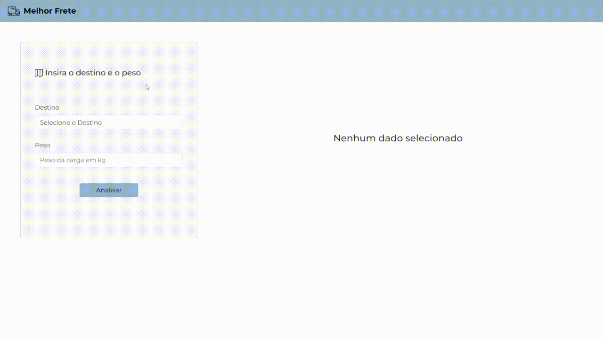

# Implementação - Desafio CoorLab

O projeto consiste em uma aplicação web que permite ao analista de logística analisar e comparar as opções de frete disponíveis. O usuário pode inserir o peso do frete e a cidade de destino, e a aplicação exibirá o frete mais econômico e o frete mais rápido. A aplicação consome dados de uma API REST que disponibiliza as cotações de frete estruturadas.

A implementação utiliza Vue.js como framework JavaScript, e outras bibliotecas e pacotes foram utilizados para a construção da aplicação. O ambiente de desenvolvimento é compatível com desktop e mobile, proporcionando uma experiência responsiva para os usuários.

_________________________________________________________________________

## Instruções para Execução Local

Para executar o projeto localmente, siga as instruções abaixo:

1. Certifique-se de estar na branch "master" do repositório.
2. Clone este repositório em sua máquina local.
3. Acesse o diretório raiz do projeto.
4. Execute o comando para instalar as dependências do projeto:
```
npm install
```
5. Execute o comando para ligar o servidor da API REST:
```
npm run api_serve
```
6. Execute o comando para iniciar o servidor de desenvolvimento:
```
npm run serve
```
7. Acesse `http://localhost:8080` no seu navegador para visualizar a aplicação.

_________________________________________________________________________

## Ambiente Desktop

A aplicação foi projetada para oferecer uma experiência completa em dispositivos desktop. Abaixo, esta o GIF que demonstra o funcionamento da aplicação no ambiente desktop:

<p align="center">
  
</p>

## Ambiente Mobile

A aplicação é responsiva e oferece suporte para dispositivos móveis. Abaixo, esta o GIF que mostram o funcionamento da aplicação no ambiente mobile:

<p align="center">
  
</p>

_________________________________________________________________________


## Instruções para Execução no Vercel

Para executar a aplicação no Vercel, siga as instruções abaixo:

A aplicação está disponível na plataforma Vercel e pode ser acessada através do seguinte link: [Link da Aplicação](https://desafio-coorlab.vercel.app/).

Para obter os dados simulados da API, a aplicação faz uma requisição GET para a rota https://json-server-vercel-ten-psi.vercel.app/transport. É importante mencionar que podem ocorrer erros devido à instabilidade dos servidores.

## Pacotes e Versões Utilizadas

A implementação utilizou os seguintes pacotes e versões:

```
{
    Vue.js: 2.6.14
    VueX: 3.6.2
    Axios: 1.4.0
    Bootstrap: 5.1.3
    BootstrapVue: 2.22.0
}
```
